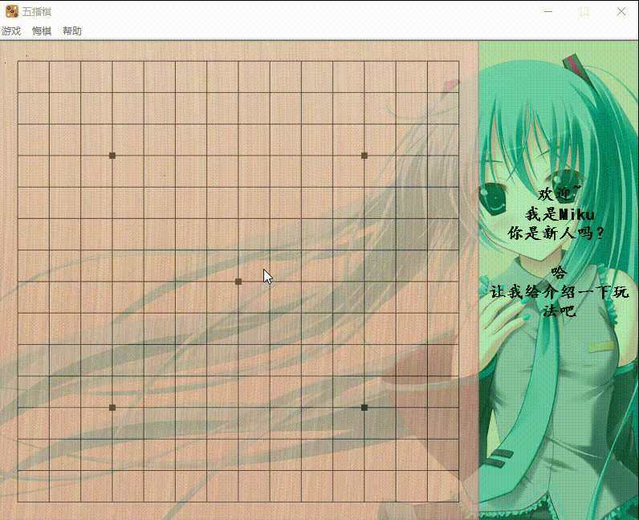

# 简介

这里是大一时学习C语言的大作业，原本要求使用“easyx”库进行编程的，但是写到一半发现用“easyx”写崩了，成了一团糟的东西了。
代码脱离掌控，于是借此机会去了解了一下“winapi”，参考了不少资料，其中微软文档是最顶用的。但是现在使用“winapi”进行Windows客户端开发已经不是推荐的做法了，或许应该使用 C# 吧，我对 C# 了解不多。

没啥经验，许多代码都是写了删、删了写，磕磕碰碰的，东平西凑也算是把这个东西给整了出来算是交了差了吧。

不过话说回来，学习“winapi”也是非常有用的，可以了解 Windows 的消息机制，理解窗口处理过程，摆脱只会写“黑乎乎”的程序的尴尬，至少接触了一些 GUI 方便的内容了嘛。

本来想自己实现五指棋的AI功能的，也学习了不少相关知识，但是自己做的小玩意真的太差劲了，可谓是“智障AI”，为了挽回一些颜面，这里就采用了“yixin”作为五指棋的AI引擎，不得不说“yixin”是真的牛，还获得过世界冠军。

- Yixin-Board：https://github.com/accreator/Yixin-Board
- Yixin-protocol：https://github.com/accreator/Yixin-protocol

## 实现功能

 - 人人
 - 人机
    - 玩家先走
    - 电脑先走
        - 设置难度
 - 棋谱
    - 创建
    - 查看
    - 载入
    - 保存
 - 悔棋
 - 音效

### 截图

## 更新日志

2021年10月15日
 - 迁移仓库，更新“README”

2019年12月8日
 - 修复pbrain不能正常结束的`重大`BUG
 - 修复`落子有时不显示`BUG
 - 优化界面
 - 不确定是否修复了`界面偶尔的闪烁`的BUG

*PS:之前没有写更新日志，也忘记更新了啥，就空着了*
